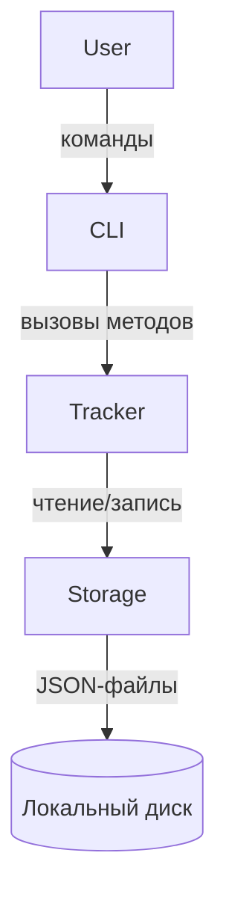

# Дизайн-документ: Calorie Tracker

## Обзор

Calorie Tracker — модульное Python-приложение для локального учёта калорий. Пользователь взаимодействует с программой через CLI: добавляет приёмы пищи и просматривает статистику за день, неделю, месяц или год. Данные хранятся в JSON-файлах на диске (по одному файлу на день).

Ключевые принципы:
- Чёткое разделение ответственности: `storage` → `tracker` → `cli`
- Зависимость через интерфейсы (Protocol), а не конкретные реализации
- Простота: никаких внешних баз данных, только стандартная библиотека Python + опциональные зависимости для CLI

---

## Архитектура



Слои взаимодействуют строго сверху вниз. CLI не знает о Storage; Tracker не знает о конкретном классе Storage — только об интерфейсе `StorageProtocol`.

### Структура пакета

```
calorie_tracker/
├── main.py              # точка входа
├── models.py            # модели данных (dataclasses)
├── storage.py           # реализация хранилища (JsonStorage)
├── tracker.py           # бизнес-логика (CalorieTracker)
└── cli.py               # CLI (argparse)
```

---

## Компоненты и интерфейсы

### StorageProtocol (интерфейс)

```python
from typing import Protocol
from datetime import date
from calorie_tracker.models import Entry

class StorageProtocol(Protocol):
    def save(self, entry: Entry) -> None: ...
    def load_day(self, day: date) -> list[Entry]: ...
```

### JsonStorage

Реализует `StorageProtocol`. Хранит записи в директории `~/.calorie_tracker/` (конфигурируемо).

- `save(entry)` — дописывает запись в файл `YYYY-MM-DD.json`; создаёт директорию при необходимости.
- `load_day(day)` — читает файл дня; при повреждённом JSON бросает `StorageError`.

### CalorieTracker

Принимает `StorageProtocol` через конструктор (dependency injection).

| Метод | Описание |
|---|---|
| `add_entry(name, calories)` | Валидирует входные данные, создаёт `Entry`, сохраняет через storage |
| `get_day_stats(day)` | Возвращает `DayStats` |
| `get_week_stats(week_date)` | Возвращает `WeekStats` (пн–вс) |
| `get_month_stats(year, month)` | Возвращает `MonthStats` |
| `get_year_stats(year)` | Возвращает `YearStats` |

### CLI

Построен на `argparse`. Субкоманды:

| Команда | Аргументы | Описание |
|---|---|---|
| `add` | `name`, `calories` | Добавить приём пищи |
| `stats day` | `[--date YYYY-MM-DD]` | Статистика за день |
| `stats week` | `[--date YYYY-MM-DD]` | Статистика за неделю |
| `stats month` | `[--year YYYY] [--month MM]` | Статистика за месяц |
| `stats year` | `[--year YYYY]` | Статистика за год |

При неизвестной команде выводится справка (`parser.print_help()`). При ошибке — сообщение в stderr и `sys.exit(1)`.

---

## Модели данных

### Entry

```python
from dataclasses import dataclass
from datetime import datetime

@dataclass
class Entry:
    name: str           # название блюда (непустое, не только пробелы)
    calories: int       # 1..99_999
    timestamp: datetime # UTC, проставляется автоматически при создании
```

JSON-представление одного файла (`YYYY-MM-DD.json`):

```json
[
  {"name": "Овсянка", "calories": 350, "timestamp": "2024-01-15T08:30:00"},
  {"name": "Кофе с молоком", "calories": 80, "timestamp": "2024-01-15T09:00:00"}
]
```

### Статистические объекты

```python
@dataclass
class DayStats:
    day: date
    entries: list[Entry]
    total: int

@dataclass
class WeekStats:
    week_start: date          # понедельник
    days: dict[date, int]     # дата → сумма калорий
    total: int
    daily_average: float

@dataclass
class MonthStats:
    year: int
    month: int
    days: dict[date, int]
    total: int
    daily_average: float

@dataclass
class YearStats:
    year: int
    months: dict[int, int]    # номер месяца → сумма калорий
    total: int
    monthly_average: float
```

### Исключения

```python
class TrackerError(Exception): pass      # ошибки валидации
class StorageError(Exception): pass      # ошибки чтения/записи
```

---

## Свойства корректности

*Свойство — это характеристика или поведение, которое должно выполняться при всех допустимых выполнениях системы. По сути, это формальное утверждение о том, что система должна делать. Свойства служат мостом между читаемыми человеком спецификациями и машинно-верифицируемыми гарантиями корректности.*

### Свойство 1: Round-trip добавления записи

*Для любых* валидных названия блюда и количества калорий: после вызова `add_entry(name, calories)` последующий вызов `get_day_stats(today)` должен содержать запись с теми же `name` и `calories`.

**Validates: Requirements 1.1, 6.5**

---

### Свойство 2: Невалидные калории отклоняются

*Для любого* значения калорий, не являющегося целым числом в диапазоне 1–99 999 (т.е. ≤ 0, ≥ 100 000, нецелое), вызов `add_entry` должен бросать `TrackerError` и не сохранять запись в хранилище.

**Validates: Requirements 1.2, 1.4**

---

### Свойство 3: Пустое или пробельное название отклоняется

*Для любой* строки, состоящей исключительно из пробельных символов (включая пустую строку), вызов `add_entry` должен бросать `TrackerError` с сообщением «Название блюда не может быть пустым».

**Validates: Requirements 1.3**

---

### Свойство 4: Корректность агрегации по периодам

*Для любого* набора записей, добавленных в трекер: суммарное поле `total` в объектах `DayStats`, `WeekStats`, `MonthStats`, `YearStats` должно точно равняться арифметической сумме `calories` всех записей, попадающих в соответствующий период.

**Validates: Requirements 2.1, 3.1, 4.1, 5.1**

---

### Свойство 5: Корректность вычисления среднего

*Для любого* непустого набора записей: `daily_average` в `WeekStats` должен равняться `total / 7`; `daily_average` в `MonthStats` — `total / количество_дней_в_месяце`; `monthly_average` в `YearStats` — `total / 12`.

**Validates: Requirements 3.3, 4.3, 5.3**

---

### Свойство 6: Пустой период возвращает нулевую сумму

*Для любой* даты, недели, месяца или года, за которые не существует ни одной записи: поле `total` соответствующего объекта статистики должно равняться 0.

**Validates: Requirements 2.3, 3.4, 4.4, 5.4**

---

### Свойство 7: Round-trip хранилища

*Для любой* корректной `Entry` (валидные `name`, `calories`, `timestamp`): вызов `storage.save(entry)` с последующим `storage.load_day(entry.timestamp.date())` должен вернуть список, содержащий запись, эквивалентную исходной (включая Unicode-символы в названии).

**Validates: Requirements 6.1, 6.4, 6.5**

---

### Свойство 8: CLI возвращает ненулевой код при ошибке

*Для любых* входных данных, вызывающих `TrackerError` или `StorageError` (невалидные калории, повреждённый файл и т.д.): CLI должен завершаться с кодом возврата, отличным от 0.

**Validates: Requirements 8.4**

---

### Свойство 9: CLI выводит справку для неизвестных команд

*Для любой* строки, не совпадающей ни с одной из известных команд (`add`, `stats`): CLI должен вывести текст справки, содержащий перечень доступных команд.

**Validates: Requirements 8.3**

---

## Обработка ошибок

| Ситуация | Исключение | Поведение |
|---|---|---|
| Калории ≤ 0 или ≥ 100 000 | `TrackerError` | Сообщение с допустимым диапазоном |
| Название пустое / только пробелы | `TrackerError` | «Название блюда не может быть пустым» |
| Повреждённый JSON-файл | `StorageError` | Сообщение с путём к файлу; файл не перезаписывается |
| Директория данных отсутствует | — | `JsonStorage.save` создаёт её автоматически (`mkdir -p`) |
| Неизвестная команда CLI | — | Вывод справки, код возврата 0 |
| Любая `TrackerError` / `StorageError` в CLI | — | Сообщение в stderr, `sys.exit(1)` |

Все исключения наследуются от базовых классов `TrackerError` и `StorageError`, что позволяет CLI перехватывать их единым блоком `except`.

---

## Стратегия тестирования

### Двойной подход

Используются два взаимодополняющих вида тестов:

- **Unit-тесты** — конкретные примеры, граничные случаи, интеграционные точки
- **Property-тесты** — универсальные свойства, проверяемые на случайных входных данных

### Библиотека для property-based тестирования

Используется **[Hypothesis](https://hypothesis.readthedocs.io/)** — стандарт для Python PBT.

```
pip install hypothesis pytest
```

### Конфигурация property-тестов

- Минимум **100 итераций** на каждый тест (настраивается через `@settings(max_examples=100)`)
- Каждый тест помечается комментарием в формате:
  `# Feature: calorie-tracker, Property N: <текст свойства>`

### Покрытие unit-тестами

| Модуль | Что тестируем |
|---|---|
| `storage` | Создание директории; корректное имя файла; ошибка при невалидном JSON |
| `tracker` | Поведение по умолчанию (текущая дата/неделя/месяц/год); пустые периоды |
| `cli` | Команда `add` с валидными аргументами; команды `stats day/week/month/year`; неизвестная команда |

### Покрытие property-тестами

Каждое свойство из раздела «Свойства корректности» реализуется **одним** property-тестом:

| Тест | Свойство | Генераторы Hypothesis |
|---|---|---|
| `test_add_entry_round_trip` | Свойство 1 | `st.text(min_size=1)`, `st.integers(1, 99_999)` |
| `test_invalid_calories_rejected` | Свойство 2 | `st.one_of(st.integers(max_value=0), st.integers(min_value=100_000))` |
| `test_blank_name_rejected` | Свойство 3 | `st.text(alphabet=st.characters(whitelist_categories=('Zs',)))` |
| `test_aggregation_correctness` | Свойство 4 | `st.lists(entry_strategy)` |
| `test_average_correctness` | Свойство 5 | `st.lists(entry_strategy, min_size=1)` |
| `test_empty_period_returns_zero` | Свойство 6 | `st.dates()` |
| `test_storage_round_trip` | Свойство 7 | `entry_strategy` (включая Unicode) |
| `test_cli_nonzero_exit_on_error` | Свойство 8 | `st.integers(max_value=0)` (невалидные калории) |
| `test_cli_help_on_unknown_command` | Свойство 9 | `st.text().filter(lambda s: s not in ('add', 'stats'))` |

### Структура тестов

```
tests/
├── test_storage.py      # unit + property (Свойство 7)
├── test_tracker.py      # unit + property (Свойства 1–6)
└── test_cli.py          # unit + property (Свойства 8–9)
```
